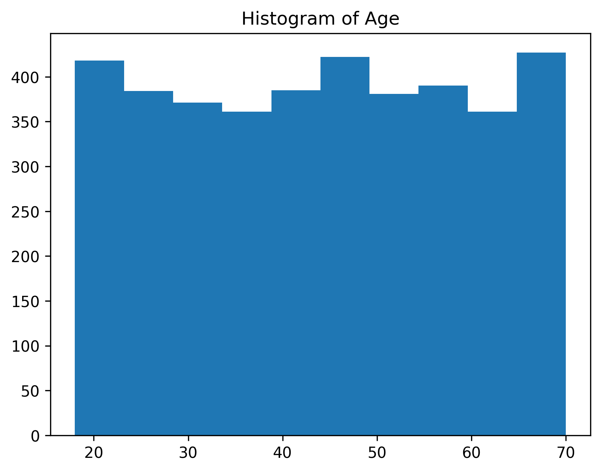

# 🛍️ Shopping Trends Exploratory Data Analysis (EDA)

## 📌 Project Overview

This project performs **Exploratory Data Analysis (EDA)** on a Shopping Trends dataset to uncover customer purchasing behavior, identify meaningful patterns, and generate business insights using Python.

The analysis includes data cleaning, descriptive statistics, visualizations, and trend analysis to better understand customer demographics, purchasing habits, seasonal preferences, and shopping behavior.

---

## 🎯 Objectives

- Understand the structure of the dataset
- Explore customer demographics
- Analyze purchasing behavior
- Identify seasonal shopping trends
- Visualize important patterns
- Generate business insights from the data

---

## 📂 Dataset

The dataset contains customer shopping information, including:

- Customer Age
- Gender
- Item Purchased
- Category
- Purchase Amount
- Location
- Season
- Subscription Status
- Payment Method
- Shipping Type
- Review Rating
- Discount Applied
- Promo Code Used
- Previous Purchases
- Preferred Payment Method
- Frequency of Purchases

Dataset file:

```
data/shopping_trends.csv
```

---

## 🛠️ Technologies Used

- Python
- Pandas
- NumPy
- Matplotlib
- Seaborn
- Jupyter Notebook

---

## 📁 Project Structure

```
Shopping-Trends-EDA/
│
├── data/
│   └── shopping_trends.csv
│
├── notebook/
│   └── Shopping_Trends.ipynb
│
├── images/
│
├── README.md
└── requirements.txt
```

---

## 📊 Exploratory Data Analysis Performed

### Data Understanding

- Dataset Shape
- Dataset Information
- Data Types
- Missing Values
- Duplicate Records

### Data Exploration

- Descriptive Statistics
- Unique Value Analysis
- Distribution Analysis
- Category-wise Analysis

### Visualizations

The project includes multiple visualizations such as:

- Customer Age Distribution
- Gender Distribution
- Purchase Amount Analysis
- Product Category Distribution
- Seasonal Purchase Trends
- Subscription Status Analysis
- Payment Method Distribution
- Review Rating Analysis

---

## 🔍 Key Insights

Some important observations from the analysis include:

- Customer purchasing patterns vary across different product categories.
- Seasonal trends influence shopping behavior.
- Subscription status impacts customer purchases.
- Purchase amounts differ across customer groups.
- Payment preferences vary among customers.
- Demographic information helps identify customer segments.

---

## ▶️ How to Run

### Clone the repository

```bash
git clone https://github.com/YOUR_USERNAME/Shopping-Trends-EDA.git
```

### Navigate to the project

```bash
cd Shopping-Trends-EDA
```

### Install dependencies

```bash
pip install -r requirements.txt
```

### Open the notebook

```bash
jupyter notebook
```

Open:

```
notebook/Shopping_Trends.ipynb
```

---

## 📷 Sample Visualizations

*(You can add your saved graphs here later.)*

Example:

```markdown



```

---

## 📈 Future Improvements

- Perform Feature Engineering
- Build Customer Segmentation Models
- Develop Purchase Prediction Models
- Create an Interactive Dashboard using Plotly or Streamlit
- Apply Machine Learning Algorithms

---

## 🤝 Contributing

Suggestions and improvements are always welcome.

If you'd like to improve this project, feel free to fork the repository and submit a pull request.

---

## 👨‍💻 Author

**Madesh B S**

Aspiring AI & Machine Learning Engineer

GitHub: https://github.com/madeshbs17-lgtm

---

⭐ If you found this project useful, consider giving it a star!
